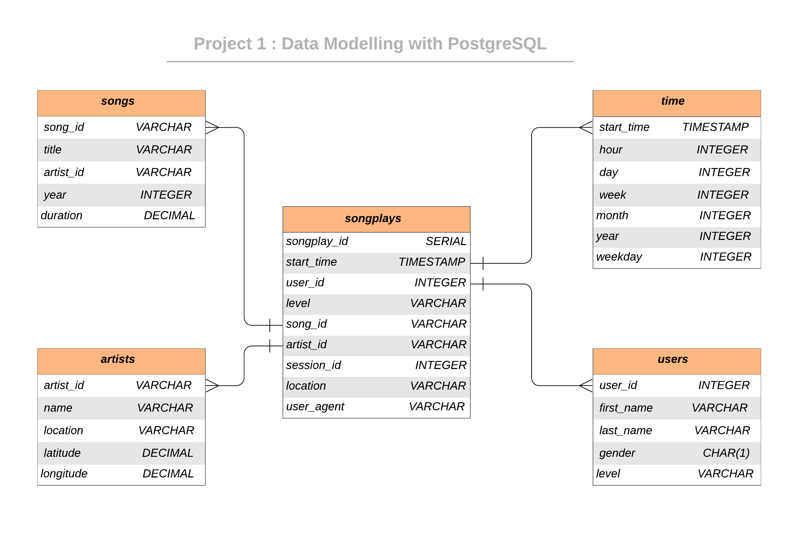

<!-- PROJECT LOGO -->
<br />

<p align="center">
 <a href="https://github.com/saikolusu9/Data-Engineering-Nanodegree">
  
 </a>
 <h2 align="center">Data Modeling ETL with PostgreSQL</h2>
 <h3 <p align="center"> 
  Project 1 </h3>
  <br />
  <br />
 </p>


</p>
&nbsp;
<!-- ABOUT THE PROJECT -->

## About The Project

### Introduction

A startup called Sparkify wants to analyze the data they've been collecting on songs and user activity on their new music streaming application. The analytics team is particularly interested in understanding what songs users are listening to. Currently, they don't have an easy way to query their data, which resides in a directory of JSON logs on user activity on the application, as well as a directory with JSON meta-data on the songs in their application.

They'd like a data engineer to create a Postgres database with tables designed to optimize queries on song play analysis. The role of this project is to create a database schema and ETL pipeline for this analysis. 

### Project Description

In this project, we will model the data with Postgres and build an ETL pipeline using Python. The fact and dimension tables for a star database schema for a particular analytic focus is defined, and an ETL pipeline that transfers data from files in two local directories into these tables in Postgres using Python and SQL was developed.

### Built With

* python
* PostgreSQL
* iPython notebooks

### Dataset
#### Song Dataset
Songs dataset is a subset of [Million Song Dataset](http://millionsongdataset.com/).  Each file in the dataset is in JSON format and contains meta-data about a song and the artist of that song. 

Sample Record :
```
{"num_songs": 1, "artist_id": "ARJIE2Y1187B994AB7", "artist_latitude": null, "artist_longitude": null, "artist_location": "", "artist_name": "Line Renaud", "song_id": "SOUPIRU12A6D4FA1E1", "title": "Der Kleine Dompfaff", "duration": 152.92036, "year": 0}
```

#### Log Dataset
Logs dataset is generated by [Event Simulator](https://github.com/Interana/eventsim).  These log files in JSON format simulate activity logs from a music streaming application based on specified configurations.

Sample Record :
```
{"artist": null, "auth": "Logged In", "firstName": "Walter", "gender": "M", "itemInSession": 0, "lastName": "Frye", "length": null, "level": "free", "location": "San Francisco-Oakland-Hayward, CA", "method": "GET","page": "Home", "registration": 1540919166796.0, "sessionId": 38, "song": null, "status": 200, "ts": 1541105830796, "userAgent": "\"Mozilla\/5.0 (Macintosh; Intel Mac OS X 10_9_4) AppleWebKit\/537.36 (KHTML, like Gecko) Chrome\/36.0.1985.143 Safari\/537.36\"", "userId": "39"}
```

&nbsp;

## Database Schema Design

### Data Model ERD

The Star Database Schema used for data modeling in this ETL pipeline. There is one fact table containing all the metrics (facts) associated to each event (user actions), and four dimensions tables, containing associated information such as user name, artist name, song meta-data etc. This model enables to search the database schema with the minimum number of  *SQL JOIN*s possible and enable fast read queries. The amount of data we need to analyze is not big enough to require big data solutions or NoSQL databases.

An entity relationship diagram (ERD) of the data model is given below. 



&nbsp;
## Project structure


|  File / Folder   |                         Description                          |
| :--------------: | :----------------------------------------------------------: |
|       data       | Folder that consists of the json files which contain songs data |
|      images      |  Folder that consists of images that are used in this repository  |
|  sql_queries.py  |      File that contains all the sql queries (create, drop tables and insert records as well as query the song play table)      |
| create_tables.py |  File that creates and drops all the tables in the database. This file has to be run everytime, as a pre-requsite, when we run the ETL code         |
|    test.ipynb    |  A Test File which displays the first few rows of each table to allow us to check the inserted data                |
|    etl.ipynb     | File which reads and processes a single file from song data and log data and loads the data into the database tables |
|      etl.py      | File that contains the code which reads and processes all the files from song data and log data and loads them into the tables |
|      README      |                         Readme file                          |

&nbsp;

## *Steps for Design:*&nbsp;
1. Author the appropriate sql queries in the sql_queries.py file
2. Run the create_tables.py in the terminal 
   ```python
   python create_tables.py
   ```
3. Complete the necessary code in the etl.ipynb and run the file. this file is to insert for 1 song and log file
4. Check if records the got inserted into the tables using test.ipynb
5. If all the above steps run without any error, complete the necessary code in the etl.py and run the file(after running create_tables.py file again)    
   ```python
   python etl.py
   ```
6. Check if all the records the got inserted into the tables using test.ipynb
7. Appropriate comments and docstrings are added in the code wherever applicable