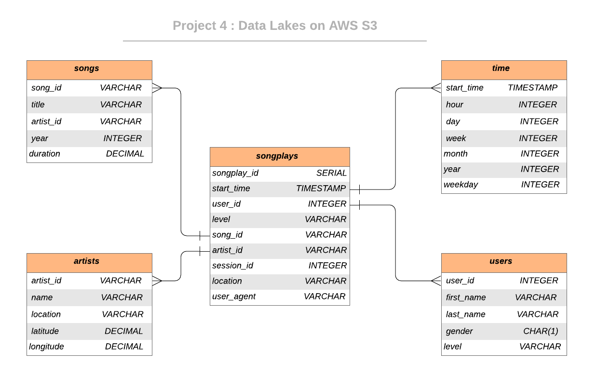

<!-- PROJECT LOGO -->
<br />

<p align="center">
 <a href="https://github.com/saikolusu9/Data-Engineering-Nanodegree">
  
 </a>
 <h3 align="center">Data Lake with AWS S3</h3>
 <h3 <p align="center">
 Project 3 </h2>
  
<br />
<br />


## Introduction
A startup called Sparkify wants to analyze the data they've been collecting on songs and user activity on their new music streaming application. Sparkify has grown their user base and song database large and want to move their data warehouse to a data lake. Their data resides in S3, in a directory of JSON logs on user activity on the application, as well as a directory with JSON metadata on the songs in their application.

They'd like a data engineer to build an ETL pipeline that extracts their data from S3,  processes them using Spark, and loads the data back into S3 as a set of fact and dimensional tables. This will allow their analytics team to continue finding insights in what songs their users are listening to. The role of this project is to create a data lake on cloud (AWS S3) and build ETL pipeline for this process. 

## Project Description

In this project, we will build a data lake on AWS S3 and build an ETL pipeline for a data lake hosted on S3. The data is loaded from S3 and processed into analytics tables using Spark and the processed data is loaded back into S3 in the form of parquet files.

### Built With

* python
* AWS

### Dataset

#### Song Dataset

Songs dataset is a subset of [Million Song Dataset](http://millionsongdataset.com/). Each file in the dataset is in JSON format and contains meta-data about a song and the artist of that song. The dataset is hosted at S3 bucket `s3://udacity-dend/song_data`.

Sample Record :

```
{"num_songs": 1, "artist_id": "ARJIE2Y1187B994AB7", "artist_latitude": null, "artist_longitude": null, "artist_location": "", "artist_name": "Line Renaud", "song_id": "SOUPIRU12A6D4FA1E1", "title": "Der Kleine Dompfaff", "duration": 152.92036, "year": 0}
```

#### Log Dataset

Logs dataset is generated by [Event Simulator](https://github.com/Interana/eventsim). These log files in JSON format simulate activity logs from a music streaming application based on specified configurations. The dataset is hosted at S3 bucket `s3://udacity-dend/log_data`.

Sample Record :

```
{"artist": null, "auth": "Logged In", "firstName": "Walter", "gender": "M", "itemInSession": 0, "lastName": "Frye", "length": null, "level": "free", "location": "San Francisco-Oakland-Hayward, CA", "method": "GET","page": "Home", "registration": 1540919166796.0, "sessionId": 38, "song": null, "status": 200, "ts": 1541105830796, "userAgent": "\"Mozilla\/5.0 (Macintosh; Intel Mac OS X 10_9_4) AppleWebKit\/537.36 (KHTML, like Gecko) Chrome\/36.0.1985.143 Safari\/537.36\"", "userId": "39"}
```


## Database Schema Design

### Data Model ERD

The Star Database Schema (Fact and Dimension Schema) is used for data modeling in this ETL pipeline. There is one fact table containing all the metrics (facts) associated to each event (user actions), and four dimensions tables, containing associated information such as user name, artist name, song meta-data etc. This model enables to search the database schema with the minimum number of *SQL JOIN*s possible and enable fast read queries. 

The data stored on S3 buckets is extracted and processed using Spark, and is then inserted into the fact and dimensional tables. This tables are stored back to S3 in parquet files, organized for optimal performance. An entity relationship diagram (ERD) of the data model is given below. 




</br>
</br>

## Project structure

| File / Folder |                         Description                          |
| :-----------: | :----------------------------------------------------------: |
|     data      | Folder where smaller version of data are stored |
|    images     |  Folder where images are stored  |
|    etl.py     | File the loads and processes the data from S3 and stores them back to S3 |
|    dl.cfg     | Sample configuration file for AWS               |
|    README     |  Readme file |


</br>
</br>

## How to run

1. Created an IAM user with Programmatic access and set permission as Administrator Access. Downloaded the Access Key CSV File

2. Created my own bucket to store the output data in parquet format in us-west-2 region.

3. Launched a separate VPC (not default) and created private subnets in us-west-2 region

4.	Launched a EMR Cluster with Spark application option and default settings in the VPC created

5.	Configured the Master node security group to allow inbound from my IP

6.	Ssh into the EMR Cluster terminal
7.	Type aws configure and press enter
8.	Entered the access keys and region as us-west-2
9.	Verified if Spark is installed by command which-spark

10. Edit the `dl.cfg` configuration file and fill in the AWS Access Key and Secret Key fields

11. Run ETL process by 

   ```python
   python etl.py
   ```

   This will execute the commands corresponding to loading data from S3, processing it using Spark and store them back to S3 in parquet files.

12.	Ran SQL queries using spark sql on the terminal itself to chec if the data is loaded properly


13. Appropriate comments and docstrings are added in the code wherever applicable