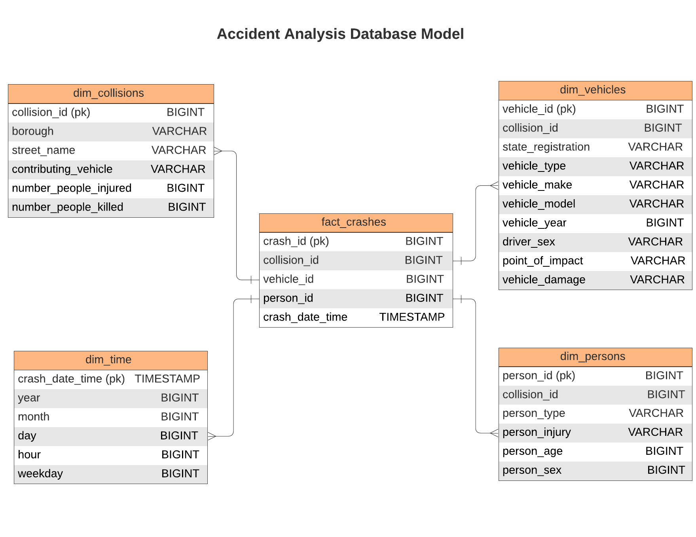
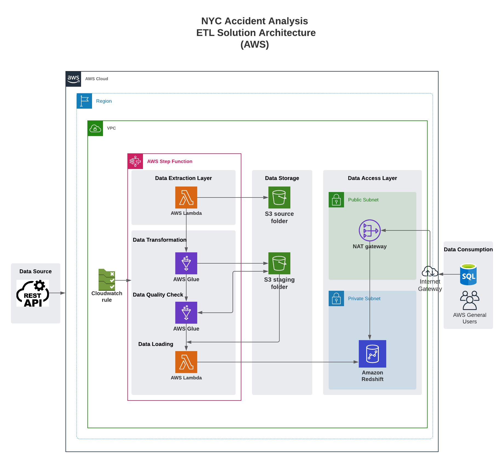
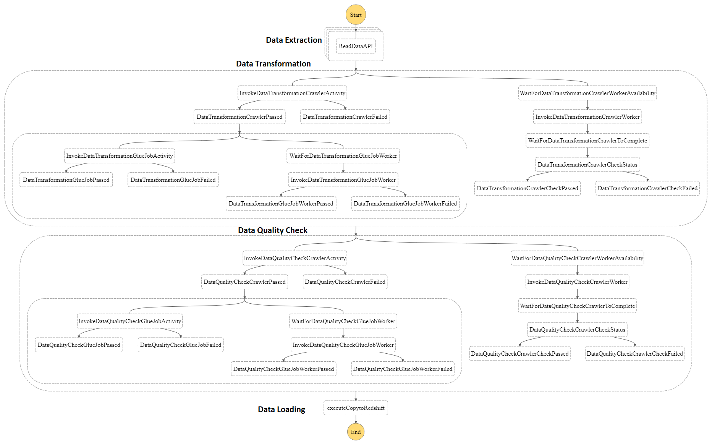
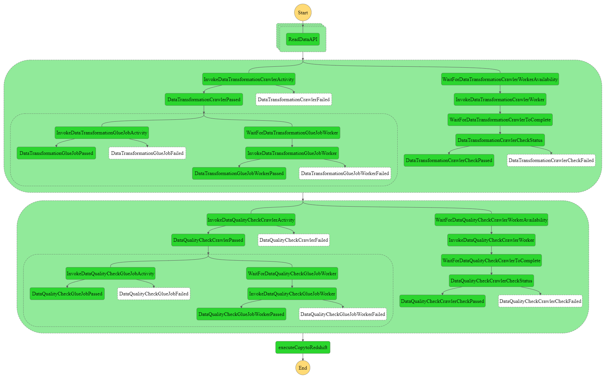

<!-- PROJECT LOGO -->
<br />

<p align="center">
 <a href="https://github.com/saikolusu9/Udacity-Data-Engineering-Nanodegree">
  
 </a>
 <h1 align="center">NYC Motor Collisions Analysis</h3>
 <h2 align="center">
 Data Engineering Capstone Project
  <br />

  <br />
  <br />
 </p>
</p>


<!-- ABOUT THE PROJECT -->

## Introduction

Automobile industries have made rapid strides over the years in designing and building safety measures for automobiles, but traffic accidents are unavoidable especially in cities like New York, which is one of the densely populated metropolitan cities in the world. The New York State DMV has been maintaining all the historical data about motor vehicles crashes since 1995 as reported by police. But since 2014, the data has been made publicly accessible and searchable in Internet. The data can also be accessed via Socrata Open Data API (SODA).

This goal of the project is to build ETL pipelines on AWS to integrate the motor vehicle crashes data in to a data warehouse, to enable data scientists and data analysts to identify the main factors associated with the crash to build predictive models.

The project follows the follow steps:

- Step 1: Scope the Project and Gather Data
- Step 2: Explore and Assess the Data
- Step 3: Define the Data Model
- Step 4: Run ETL to Model the Data
- Step 5: Complete Project Write Up

## Step 1: Scope the Project and Gather Data

### Scope of the Project

In this project, the accidents data is a combination of Collisions, Vehicles and Persons data. These 3 data sets are combinedly called as Crashes dataset. The general idea of this project is to extract all the 3 datasets, clean and transform and load it into a DataWarehouse, so as to gather insights on the pattern of accidents and common factors related to the accidents. For instance, we could answer interesting questions like which boroughs have higher rate of accidents , which type of vehicles are more involved in a crash, how many persons are getting killed in crashes on an average in a day, or, vehicle and individual persons attributes involved in a crash.

The entire ETL solution is setup on a AWS cloud platform. I have adopted __Serverless Architecture__ strategy to build the pipeline. Serverless architecture helps us to build ETL piplines without worrying about provisioning, scaling and maintenance of servers. Scaling is automatic and we pay for what we use.

Advantages of Serverless Architecture:

1. Event-based architecture: With Serverless, we can build event-based architecture where each part of application is indepedent. We can trigger the pipeline based on a incoming data(event).

2. Faster Deployments : Serverless Architecture enables faster deployments of ETL pipelines in production as there is no infrastructure construction

3. Reduce architecture costs : Serverless architecture reduces architecture costs because huge investments are not required for internal architecture administration.


### Gather Data

The dataset is extracted from NYC Motor Vehicles Public Safety website. The dataset is exposed as a API vis SODA API.
All communication with the API is done through HTTPS, and errors are communicated through HTTP response codes. The response types are selectable by the extension .json on the API endpoint or through content-negotiation with HTTP Accepts headers.

There are 3 datasets that I extracted

* Collisions
* Vehicles
* Persons

#### Collisions Dataset

Collisions dataset contains details on the crash event. Each row represents a crash event. The file in the dataset is in CSV format. The dataset is hosted at S3 bucket within a folder named Collisions

#### Vehicles Dataset

Vehicles dataset contains details on each vehicle involved in the crash. Each row represents a motor vehicle involved in a crash. The file in the dataset is in CSV format.The dataset is hosted at S3 bucket within a folder named Vehicles

#### Persons Dataset

Persons dataset contains details for people involved in the crash. Each row represents a person (driver, occupant, pedestrian, bicyclist,..) involved in a crash.. The file in the dataset is in CSV format. The dataset is hosted at S3 bucket within a folder named Persons

&nbsp;

## Step 2 : Explore and Assess the Data
### 2.1 Explore the Data
Below is the sample record for each of the 3 datasets mentioned above

#### __Collisions Dataset__

Sample Record :

```
crash_date,crash_time,on_street_name,number_of_persons_injured,number_of_persons_killed,number_of_pedestrians_injured,number_of_pedestrians_killed,number_of_cyclist_injured,number_of_cyclist_killed,number_of_motorist_injured,number_of_motorist_killed,contributing_factor_vehicle_1,contributing_factor_vehicle_2,collision_id,vehicle_type_code1,vehicle_type_code2,borough,zip_code,latitude,longitude,location,cross_street_name,off_street_name,contributing_factor_vehicle_3,contributing_factor_vehicle_4,vehicle_type_code_3,vehicle_type_code_4,contributing_factor_vehicle_5,vehicle_type_code_5
2021-04-14T00:00:00.000,5:32,BRONX WHITESTONE BRIDGE,0,0,0,0,0,0,0,0,Following Too Closely,Unspecified,4407480,Sedan,Sedan,,,,,,,,,,,,,

```
After full load, there are __1827692__ records in Collisions dataset. Please refer to [ExpDataAnalysis](./notebooks/Exploratory_Data_Analysis.ipynb)


#### __Vehicles Dataset__


Sample Record :

```
unique_id,collision_id,crash_date,crash_time,vehicle_id,state_registration,vehicle_type,contributing_factor_1,vehicle_make,vehicle_year,travel_direction,vehicle_occupants,driver_sex,driver_license_status,driver_license_jurisdiction,pre_crash,point_of_impact,vehicle_damage,public_property_damage,contributing_factor_2,vehicle_damage_1,vehicle_damage_2,vehicle_damage_3,vehicle_model,public_property_damage_type
19140702,4213082,2019-09-23T00:00:00.000,8:15,0553ab4d-9500-4cba-8d98-f4d7f89d5856,NY,Station Wagon/Sport Utility Vehicle,Driver Inattention/Distraction,TOYT -CAR/SUV,2002,North,1,M,Licensed,NY,Going Straight Ahead,Left Front Bumper,Left Front Quarter Panel,N,Unspecified,,,,,
```
After full load, there are __3664394__ records in Vehicles dataset. Please refer to [ExpDataAnalysis](./notebooks/Exploratory_Data_Analysis.ipynb)


#### __Persons Dataset__

Persons dataset contains details for people involved in the crash. Each row represents a person (driver, occupant, pedestrian, bicyclist,..) involved in a crash.. The file in the dataset is in CSV format. The dataset is hosted at S3 bucket

Sample Record :

```
unique_id,collision_id,crash_date,crash_time,person_id,person_type,person_injury,vehicle_id,ped_role,person_sex,person_age,ejection,emotional_status,bodily_injury,position_in_vehicle,safety_equipment,complaint,ped_location,ped_action,contributing_factor_1,contributing_factor_2
10255054,4230587,2019-10-25T00:00:00.000,15:15,4629e500-a73e-48dc-b8fb-53124d124b80,Occupant,Unspecified,19144075,Passenger,F,33,Not Ejected,Does Not Apply,Does Not Apply,"Front passenger, if two or more persons, including the driver, are in the front seat",Lap Belt & Harness,Does Not Apply,,,,
```
After full load, there are __4452223__ records in Persons dataset. Please refer to [ExpDataAnalysis](./notebooks/Exploratory_Data_Analysis.ipynb)


I have used pandas for exploratory data analysis to get an overview on these data sets.
I have done EDA specifically to check for size of the dataset, null values and duplicate values

### __2.2 Data Cleaning__
- As shown in the EDA analysis, there were no duplicate records in any of the datasets
All the other necessary data cleaning steps(removing null values) are incorporated as a part of Data Transformation Glue Job. 

&nbsp;

## __Step 3: Define the Data Model__

### __3.1 Concpetual Data Model__




The Star Database Schema (Fact and Dimension Schema) is used for data modeling in this ETL pipeline. There is one fact table containing all the metrics (facts) associated to each event (user actions), and four dimensions tables, containing associated information such as collision details, vehicle details, persons involved etc. This model enables to search the database schema with the minimum number of *SQL JOIN*s possible and enable fast read queries.

The data stored on S3 buckets is staged and then inserted to fact and dimensional tables on Redshift. The whole process in orchestrated using AWS Step Functions which is set to execute once every day.

### __3.2 Tools and Technologies__

The solution was built with scalable and secure ETL workflows using AWS serverless technology.

The key services within AWS used for this project are AWS S3, AWS Glue, AWS Lambda, AWS Cloudwatch, AWS Redshift. The entire process is orchastrated using AWS Step Functions.

The solution leverages AWS Lambda, AWS Glue and AWS Step Functions, for data ingestion and processing. It uses Amazon S3 and Amazon Redshift as the raw and tramnsformed data store layer respectively.

### __AWS Step Functions__
 AWS Step Functions is used as a serverless function orchestrator to build scalable big data pipelines using services such as Amazon Glue and AWS Lambda to run Apache Spark and other open-source applications on AWS in a cost-effective manner. Step Functions are made of state machines (workflows) and tasks. Tasks are individual states or single units of work.
 
 ### __AWS Glue__
 AWS Glue is used for a serverless environment to prepare (extract and transform) and load large amounts of datasets from a variety of sources for analytics and data processing with Apache Spark ETL jobs

 The following are the main components of AWS


 #### __Glue Crawler__
 Glue Crawlers are used to analyze the data in S3. It is used to populate the AWS Glue Data Catalog with tables(metadata) so that a Glue Job or Athena can view the S3 data. ETL jobs that we define in AWS Glue job use these Data Catalog tables as sources and targets. The ETL job reads from and writes to the data stores that are specified in the source and target Data Catalog tables.

#### __Glue Job__
Glue Job actually contains the business logic for the ETL process.


### __AWS Lambda__
AWS Lambda is a serverless computing service that executes the code in response to events and automatically manages the underlying computing resources. AWS Lambda can automatically run code in response to multiple events, such as HTTP requests via Amazon API Gateway, modifications to objects in Amazon S3 buckets, table updates in Amazon Redshift. In our case, it will run the code according to objects uploaded to S3 bucket.

### __3.3 Mapping Out Data Pipelines__

#### __3.1 ETL Architecture__



#### __3.2 ETL Workflow orchestration__



#### __ETL Workflow (Step by Step)__
- A Cloudwatch rule triggers the Step Function which contains the ETL workflow services. The Cloudwatch rule is set up to trigger once on a daily schedule.
- Within the Step Function, a Lambda executes recursively to read collisions, vehicles and persons data by making API calls to the respective SODA API.
- The data is written to corresponding folder in a S3 bucket in a CSV format. The data is partitioned on Year, Month and Day.
- Once the data is written to S3 bucket, a Lambda function triggers a Glue Crawler that reads the data in S3 and updates the Glue tables
- The crawler run status is tracked by another lambda function
- If the crawler successfully completes updating the Glue tables, another lambda function starts the Glue Job.
- The Glue Job contains the PySpark code that performs the required transformations and loads the transformed data back into S3 bucket in a parquet format, partitioned by Year, Month and Day.
- Then another Glue Job performs a data quality check on the transformed data loaded into the S3 bucket
- A Lambda function then performs the copy to staging tables and then finally into Redshift tables


## __Step 4: Run Pipelines to Model the Data__

### __4.1 Pre-requisites__
The following needs to be set up before running the ETL pipeline
- An AWS Account
- A VPC in us-west-2 region
- A public subnet and private subnet 
- Internet Gateway and Route tables
- NAT Gateway
- IAM Role for Step Functions to access AWS Lambda and AWS Glue
- A Lambda execution IAM role
- A Glue Service role
- IAM role for Redshift to access 

### __4.2 Running the Pipeline to create the Data Model__

The final pipeline looks like this after all the stages are successfully completed



### __4.3 Frequency of running the pipeline__

The architecture is set up in such a way that it is run once for full load and daily once for delta load
The indicator to run full load vs delta load is passed as a input to step function

#### __4.4 Data Quality Checks__

I have implemented Data quality checks on the data in the staging S3 bucket ([data_quality_check](./scripts/glue/data_quality_check.py)) in step function and after the Data Warehouse tables have been loaded ([execute_copy_to_Redshift](./scripts/lambda/fntn-copy-to-redshift)).

The data quality checks that I have done are to test that tables are not empty in the staging S3 bucket and also source/target table count is equal and do more explicit test at the end of the pipeline where the data goes to Redshift.
There I checked that the fact and dimension tables are not empty, that columns do not contain `NULL` values and that the fact table doesnt contain a null values. Also I checked the source/target count as well.

For a quick reference , I have done Data Quality check in jupyter notebook on a EMR cluster and can be found here
[data_quality_check](./notebooks/data_quality_check.ipynb)
    
#### __4.5 Data Dictionary__

Please refer to the data dictionary given here
[data_dictionary](./data_dictionary.xlsx)

## __Step 5: Complete Project Write Up__
I believe that I have covered most of the things in the above write up. Now that this dataset is available in a AWS Redshift Data Warehouse, this can be consumed by the Data Scientists or Data Analysts to create predicitve models and visualization to do a deeper analysis on the factors influencing NY accidents. 

Since the pipeline makes the data available in Redshift on a daily basis, it empowers the NYPD department to monitor the traffic very closely

### __Future Design Considerations__
__1. What if the data was increased by 100x.__

If the data was increased by 100x, I would incorporate all the steps from start to finish(data extraction, data transformation, data quality check, loading into staging and datawarehouse tables) within AWS Glue, because AWS Lambda has a execution limit of 15 minutes, hence cannot be used to extract TBs of data.

We have to employ sufficient DPUs (workers) for AWS Glue to employ 100x of data and with efficient performance tuning, AWS Glue can effectively handle TBs of data.

Another alternative (if not serverless) is to use AWS EMR which is a distributed data cluster for processing large data sets on AWS.

__2. What if the pipelines were run on a daily basis by 7am.__

This question was addressed previously. The pipeline is scheduled to trigger once everyday using a cloudwatch alarm. This is for delta load.

__3.The database needed to be accessed by 100+ people.__

Redshift has the capability to scale horizontally (adding more nodes on demand) if the load is getting high, to reduce the load on each individual node. We can do this using Elastic resize. Also we could optimize the tables based on the queries we want to execute on the cluster, by setting appropriatethe sortkey and distkey values. Also we can use Materialized views to significantly boost query performance of queries that are predictable and repeated over and over.  


&nbsp;

## __References__:
- https://data.cityofnewyork.us/Public-Safety/Motor-Vehicle-Collisions-Crashes/h9gi-nx95
- https://aws.amazon.com/blogs/big-data/build-a-serverless-event-driven-workflow-with-aws-glue-and-amazon-eventbridge/
- https://aws.amazon.com/blogs/compute/implementing-dynamic-etl-pipelines-using-aws-step-functions/
- https://docs.aws.amazon.com/redshift/latest/dg/best-practices.html


